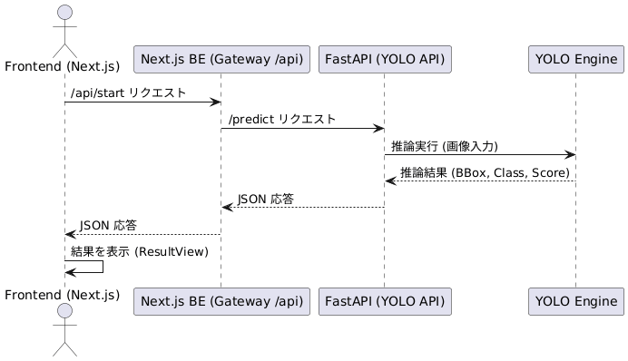

# pill-counter

## 概要
本プロジェクトではYOLOをファインチューニングし錠剤の検出と個数の出力を可能にするモデルを構築

このモデルを用いて薬剤鑑査業務を支援するWebアプリケーションを開発

利用可能なデバイスは、デスクトップ・ノートPCに加え、iPhone端末およびiOSアプリを想定

## 環境
- Typescript
- Next.js
- FastAPI
- PyTorch
- PostgreSQL
- DockerCompose
- Swift
- Tailwind

## 方針
- WebSocket/ストリーミング方式
- BEからはtext, binaryの2 channelで戻す
  - 検出imgと個数情報が非同期で整合性が取れない
    - frame_idで紐付け

## 拡張・代替案など
- webRTC
- countのoverlay
- YOLO.BBoxをJSON返却からFEで描画

